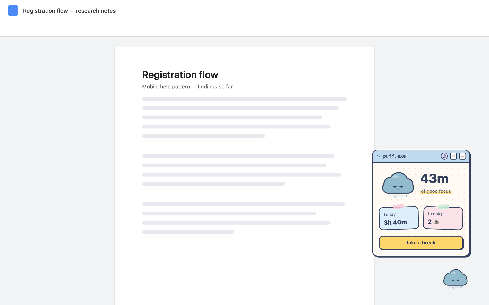
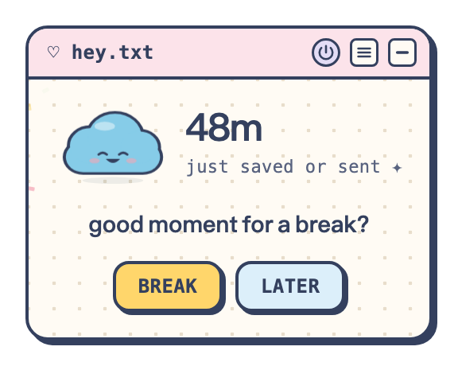
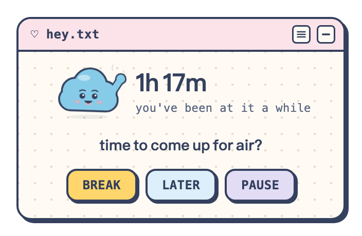
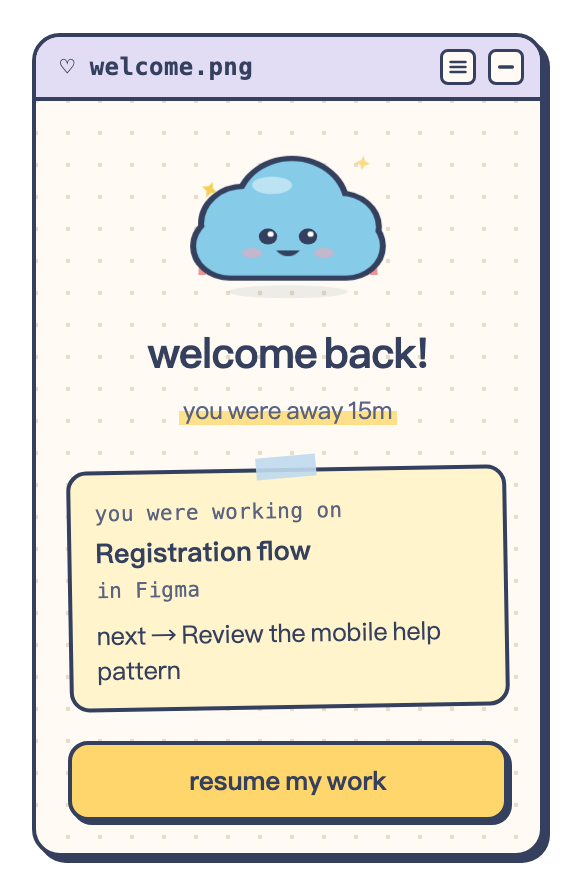
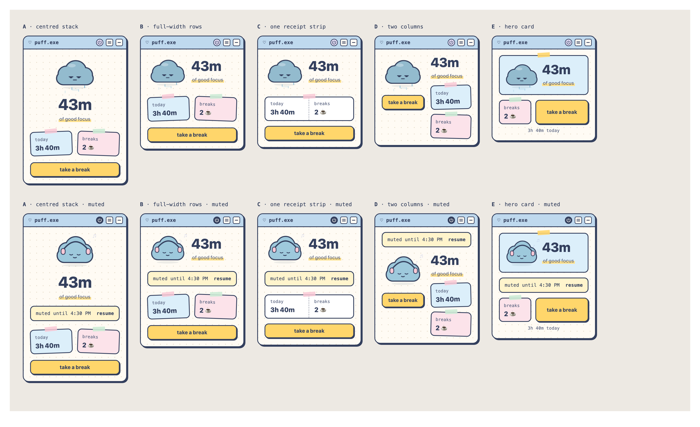

# Puff ☁️

**A small cloud in your browser that waits for a good moment to suggest a break, and holds your place while you're away.**



Most break reminders are timers: they interrupt when the clock says so, often mid-sentence. Puff waits. It notices how long you've been working, and asks only at a natural stopping point, such as right after you save or send something. When you step away, it remembers the page you were on so coming back is easy.

Puff is a Chrome extension (Manifest V3). It has no server, no account and no AI, and nothing it notices ever leaves your computer.

**Status:** v1.0.0, submitted to the Chrome Web Store. · **Team:** Anna Chen (engineering, research) and Hyeji Han (design, research).

---

## What it does

| | |
|---|---|
| **Shows your work rhythm** | Open Puff any time to see how long you've worked, today's total and breaks taken. Its weather changes as you go: sun, then rain, then a storm. |
| **Suggests a break at a good moment** | After your chosen timing (20, 30, 45 or 60 min), Puff waits for an opening: a save (⌘S / Ctrl+S), a form submit, or a pause after typing. Never while you type, and not while you're reading. |
| **Doesn't give up forever** | If no good moment comes by 1.5× your timing, Puff asks at the next brief stop, reading included (still never mid-typing). |
| **Holds your place** | Take a break and Puff keeps the page you were on and an optional note, then brings you back to it. |
| **Stays out of the way** | At most once per work session and four times a day. Later backs off. Mute for an hour or the rest of the day from the title bar. Quiet on video calls, payment pages and in full screen. |

<p>
  
  
  
</p>

## Privacy

Puff counts activity, never content.

- **It notices:** how long you're active at your computer (Chrome's idle signal), how often you click, type and scroll (counts only), and that you saved or submitted something.
- **It never reads:** what you type, what's on a page, or your tab titles and links. The one exception is the page you choose to save before a break, and Puff forgets it as soon as the break ends.
- **Where it goes:** nowhere. Everything stays in `chrome.storage.local`. Full policy: [privacy.html](https://annac777.github.io/puff/privacy.html).

## Install

**From the Chrome Web Store:** coming soon (in review).

**By hand, now:**
1. [Download this repository](https://github.com/annac777/puff/archive/refs/heads/main.zip) and unzip it.
2. Open `chrome://extensions` and turn on **Developer mode**.
3. Click **Load unpacked** and choose the `extension` folder.

To see a suggestion quickly, set the timing to 20 min in settings (≡), work for a while, then press ⌘S.

**Just want to look?** [Click through the Figma prototype](https://www.figma.com/proto/x0lRGnQD9e0F3OrOpcbjfn/Puff?page-id=110%3A8&node-id=110-10&starting-point-node-id=110%3A10) (every screen, no install).

---

## How we got here

Puff started at the AI Tinkerers *Agents Everywhere* hackathon (NYC, 12 Sept 2026) as an AI agent that would read your open tabs and run a research task while you rested. Building it showed the limits: it needed a server running on an awake computer, and reading people's tabs raised real trust problems. We cut the agent and went back to research.

### Research

| Method | Who | What we learned |
|---|---|---|
| Competitive review | 6 products (Break Buddy, Browmi, Clawd, PetPat, Cat Break, Context Keeper) | Break tools are timers; getting back into work is treated as a separate problem; privacy and reliability come up in every review. |
| Interviews | 7 people (Hyeji 3, Anna 4) | People stop at natural moments or when their body says so. Timers feel anxious or parental. Control matters. A light "you were working on… / next…" beats a summary. |
| Survey, round 1 | 9 people (our network) | Right after saving is the least disruptive moment (9 of 9); reading is among the most (7 of 9). 7 of 9 uncomfortable with tab titles. |
| Survey, round 2 | 49 valid of 50 (Prolific, US) | Confirmed timing: **86%** find a reminder right after saving or sending not or only slightly disruptive; **92%** find one while reading moderately to extremely disruptive. Only 24% find coming back hard. **61%** are uncomfortable with click and typing counts, **65%** with tab titles. |

### What changed because of it

| Before | After |
|---|---|
| AI agent works while you rest | No AI; Puff only times the break and holds your place |
| Reads open tab titles and links | Reads one page, only when you save it, and forgets it after |
| Break after a fixed time | Waits for a completion or a pause that isn't reading |
| Detailed return summary | "You were working on… / next…" |
| Puff decides | Break / Later / Mute, with a timing you choose |
| A generic soft UI | A retro sticker-notebook UI where every screen is a little window (`puff.exe`, `hey.txt`, `away.mp3` …) |



### Design

- **Figma style guide:** foundations, components, 14 character moods, motion keyframes, every screen, and Puff in context. [Open in Figma](https://www.figma.com/design/x0lRGnQD9e0F3OrOpcbjfn/Puff)
- **Character:** each mood is tied to something Puff can actually observe (focused, tired with rain, a storm when very tired, a soaked pleading cloud when long overdue, a rainbow on return after rain). All animation is CSS and stops under reduced motion.

### Open questions

- **Activity counts.** They drive the timing, yet 61% of round-2 respondents were uncomfortable with them. Should counting be opt-in, with an idle-only mode as the default?
- **AI.** Kept out for now: we can't cover model costs, bring-your-own-key is a barrier, and sending content out raises privacy concerns. An optional "help me catch up" on return is a hypothesis to test later.
- **Beyond the browser.** An ambient desk companion that reflects the same rhythm without a pop-up.

---

## Development

```
extension/        the shipping extension (service worker, content script, timing engine, tests)
  core.js         when to suggest a break: rhythm, openings, cooldowns, overdue
  background.js   state, Chrome APIs (idle, tabs, alarms, storage)
  content.js      the on-page cloud and panel frame, activity counts
  app/            the built panel UI (generated from ui-source)
ui-source/        the panel UI: React 19 + Tailwind v4 + Vite
  src/App.tsx     screens and panel
  src/Cloud.tsx   Puff, every mood, weather and seasons
  scripts/        export tools for Figma (screens, keyframes, in-context scenes, prototype)
design/           Figma exports, layout iterations
docs/research/    survey, interview guide, results
store/            Chrome Web Store listing, screenshots, packaging script
```

```sh
npm test                # 51 unit tests for the timing engine and the extension
cd ui-source && npm run build   # then copy ui-source/dist into extension/app
./store/package.sh      # build, test and zip for the Chrome Web Store
```

## Versions

- **v1.0.0** (current, `main`): research-informed, retro UI, Web Store submission.
- **Retro redesign:** commit `8df6f81`.
- **First research-informed rebuild:** commit `e28f527`.
- **Hackathon build (AI agent, OpenAI Agents SDK + Exa):** in the git history before the scope reduction (`e559f98` "Make Puff work with no server at all"), and the original repository [adaptive-off-ramp-agent](https://github.com/annac777/adaptive-off-ramp-agent).

## Credits

Made by Anna Chen and Hyeji Han. Fonts: Outfit and DM Mono. Built with help from Claude Code.
